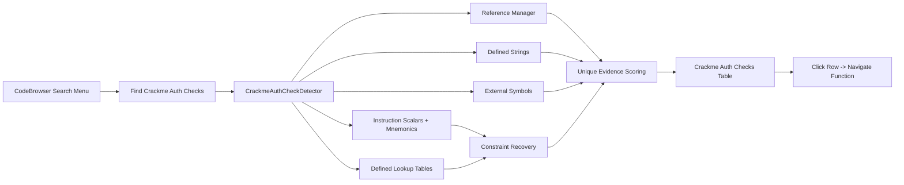
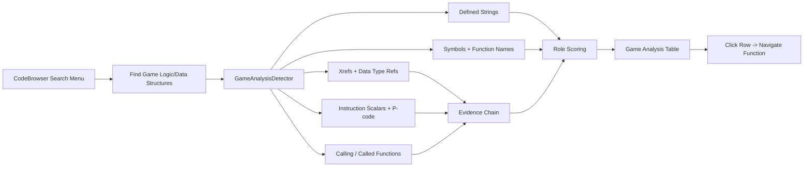
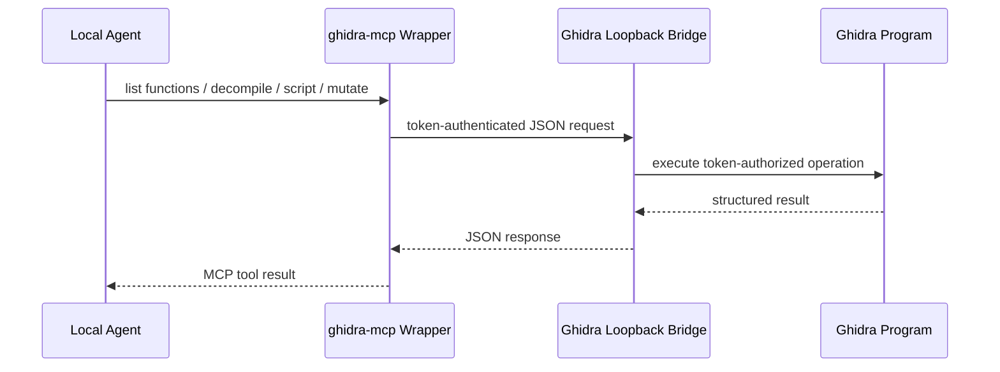
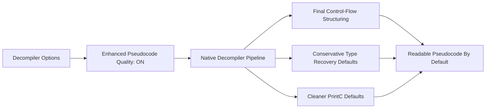
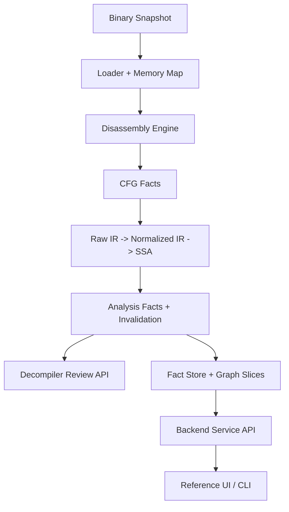

<p align="center">
  
</p>

<h1 align="center">BYTE GHIDRA</h1>

<p align="center">
  <strong>A hardened reverse-engineering workbench for crackmes, malware triage, agent workflows, and next-generation backend analysis.</strong>
</p>

<p align="center">
  
  
  
  
  
  
</p>

```text
██████╗ ██╗   ██╗████████╗███████╗     ██████╗ ██╗  ██╗██╗██████╗ ██████╗  █████╗
██╔══██╗╚██╗ ██╔╝╚══██╔══╝██╔════╝    ██╔════╝ ██║  ██║██║██╔══██╗██╔══██╗██╔══██╗
██████╔╝ ╚████╔╝    ██║   █████╗      ██║  ███╗███████║██║██║  ██║██████╔╝███████║
██╔══██╗  ╚██╔╝     ██║   ██╔══╝      ██║   ██║██╔══██║██║██║  ██║██╔══██╗██╔══██║
██████╔╝   ██║      ██║   ███████╗    ╚██████╔╝██║  ██║██║██████╔╝██║  ██║██║  ██║
╚═════╝    ╚═╝      ╚═╝   ╚══════╝     ╚═════╝ ╚═╝  ╚═╝╚═╝╚═════╝ ╚═╝  ╚═╝╚═╝  ╚═╝
```

## What This Fork Adds

Byte Ghidra keeps the upstream Ghidra foundation and layers on tooling for faster binary understanding, crackme workflows, agent-safe automation, and a backend-first analysis prototype.

| Feature | Status | Where |
|---|---:|---|
| Crackme/auth-check discovery in CodeBrowser | Implemented | `Ghidra/Features/Base/src/main/java/ghidra/app/plugin/core/codebrowser/` |
| Static game-logic and data-structure discovery in CodeBrowser | Implemented | `Ghidra/Features/Base/src/main/java/ghidra/app/plugin/core/codebrowser/` |
| Safe local MCP bridge for agent workflows | Implemented | `Ghidra/Extensions/GhidraMcp/` |
| AI malware-analysis suite for evidence-backed agent workflows | Implemented | `Ghidra/Extensions/GhidraMcp/src/main/java/ghidra/app/plugin/core/mcp/` |
| Default-on enhanced pseudocode quality | Implemented | `Ghidra/Features/Decompiler/` |
| Flat Dark default theme and richer default tool UX | Implemented | `Ghidra/Framework/Gui/`, `Ghidra/Configurations/Public_Release/` |
| Rust backend-first reverse-engineering prototype | Implemented | `re-platform/` |
| Detector and hardening tests | Implemented | `Ghidra/Features/Base/src/test/java/...`, `re-platform/tests/` |
| Professional source package README | Implemented | `README.md` |

## Feature 1: CodeBrowser Crackme Hunter

The CodeBrowser now includes a deterministic search action for CTF/crackme-style authentication logic.

```text
CodeBrowser -> Search -> For Crackme Auth Checks
```

The detector ranks candidate functions by combining explainable signals:

- Auth strings: `password`, `serial`, `license`, `key`, `login`
- Result strings: `correct`, `success`, `wrong`, `invalid`, `denied`
- Input APIs: `scanf`, `fgets`, `read`, `GetDlgItemTextA/W`, `cin`
- Compare APIs: `strcmp`, `strncmp`, `memcmp`, `lstrcmp`, `CompareStringA/W`
- Import-name normalization for common decorated symbols like `__imp__strcmp`, `strcmp@GLIBC_*`, and `_GetDlgItemTextA@16`
- Local constraint recovery for ASCII digit/hex conversions, XOR transforms, additive math, bit masks/shifts, compare values, byte/nibble limits, and defined lookup tables

The results table shows:

- Function entry address
- Function name
- Confidence score
- Evidence summary
- Recovered constraints
- Input shape hints
- Referenced strings



### Why It Is Useful

Crackmes often hide the important logic in small validation functions surrounded by noise. This feature gives analysts a ranked shortlist of functions likely to contain password checks, serial validation, success/failure branches, comparison logic, or inline byte transforms.

The detector is deterministic and explainable. It does not execute samples or bypass checks; it recovers static hints that make the next manual or symbolic pass faster.

## Feature 2: Static Game Logic Finder

The CodeBrowser also includes an offline static game-analysis workflow for rebased memory dumps and game binaries you are authorized to inspect.

```text
CodeBrowser -> Search -> For Game Logic/Data Structures...
```

This is designed for offline single-player research, modding, debugging, CTFs, and authorized reverse engineering. It does not attach to live games, bypass anti-cheat, patch memory, or provide multiplayer cheating support. The first run shows this disclaimer and stores the acknowledgement under:

```text
Edit -> Tool Options -> Game Analysis
```

The analyzer ranks candidate functions and data paths for:

- Entity arrays and object lists
- Player state and local-player controllers
- Health, shield, armor, damage, and death checks
- Ammo, weapons, clips, reload paths, and fire/consume logic
- Abilities, skills, mana, stamina, charges, and cooldowns
- Inventory, items, slots, pickups, and containers
- Coordinates, transforms, velocity, vector math, and movement state
- VTables, RTTI/type information, constructors, and dispatch logic

The results table shows:

- Address and function name
- Candidate kind
- Confidence score
- Evidence chain explaining why the result was selected
- Likely structure or field offsets recovered from instruction scalars
- Referenced gameplay strings
- Call graph summary



The scan is capped for large dumps. It seeds from gameplay strings, symbols, and function names, then inspects references, instructions, P-code operations, local scalars, and call graph neighborhoods to explain conclusions instead of relying on keyword matches alone.

## Feature 3: Ghidra MCP Bridge

`GhidraMcp` exposes Ghidra operations to local AI tools through a loopback bridge and a stdio MCP wrapper. A valid per-session bridge token is required for every request, but mutating capabilities still require explicit policy toggles and per-call confirmation in Ghidra.

The bridge is visible from the GUI by default in the CodeBrowser tool:

```text
Tools -> Ghidra MCP -> Start Bridge
Tools -> Ghidra MCP -> Stop Bridge
Tools -> Ghidra MCP -> Copy Bridge Token
Tools -> Ghidra MCP -> Status...
Edit -> Tool Options -> Ghidra MCP -> Bridge Port
```

`Bridge Port` is a preferred starting port, not a single-instance lock. If the configured
port is already in use, Byte Ghidra automatically tries the next loopback ports. This lets
multiple Ghidra sessions run MCP side by side:

```text
First Ghidra session  -> 127.0.0.1:18090
Second Ghidra session -> 127.0.0.1:18091
Third Ghidra session  -> 127.0.0.1:18092
```

Use `Tools -> Ghidra MCP -> Status...` in each session to see the actual URL, then copy that
session's bridge token with `Tools -> Ghidra MCP -> Copy Bridge Token`.

```text
Ghidra UI <-> Loopback Bridge <-> MCP stdio wrapper <-> Local agent/client
```



### MCP Capabilities

Token-authenticated operations include:

- Program metadata
- Functions and symbols
- Strings and memory blocks
- Cross-references
- Disassembly
- Decompiled function output
- Navigation, selection, and highlighting
- Policy-gated annotation writes: rename symbols, set comments, add bookmarks, set signatures
- Policy-gated program analysis writes: analyze pending changes or rerun analysis
- Policy-gated script tools: `list_ghidra_scripts` and `run_ghidra_script`
- Policy-gated AI suite state tools for tasks, triage, evidence, hypotheses, draft generation, and sandbox evidence import

The bridge remains local-only:

- The bridge binds to `127.0.0.1` and requires a per-session token
- Multiple Ghidra instances can run bridges at once by auto-incrementing from the configured port
- Bridge controls are visible under `Tools -> Ghidra MCP`
- Keep the token private; policy toggles and confirmations limit what a token-bearing client can do

```mermaid
flowchart TD
    request["MCP Request"] --> token{"Valid Bridge Token?"}
    token -- "No" --> reject["Reject"]
    token -- "Yes" --> class{"Operation Class"}
    class --> read["Read / Navigate"]
    class --> write["Annotate / Analyze / Mutate"]
    class --> script["Run Ghidra Script"]
    read --> execute["Execute in Current Ghidra Session"]
    write --> execute
    script --> execute
```

### AI Malware Analysis Suite

`GhidraMcp` also includes an AI-assisted malware-analysis workspace built on the same local bridge and policy model. Enable the `AI malware analysis suite` plugin to open dockable panels for:

- Agent task queue
- Evidence table
- Session timeline
- Malware triage dashboard
- Hypothesis tracker
- Explain With Evidence
- Semantic function search
- Decompiler diff notes
- Suspicious control-flow candidates
- YARA rule drafts
- Config extractor drafts
- Type-recovery suggestions
- Sandbox evidence import

The suite stores shared in-memory analysis state through `AiAnalysisService`, so UI actions and MCP tools see the same evidence records, tasks, hypotheses, and timeline events.

```text
AI Analysis -> Queue Triage Task
AI Analysis -> Run Triage
```

MCP tools added for the suite include:

- `create_agent_task`, `list_agent_tasks`, `approve_agent_task`, `cancel_agent_task`
- `run_triage`, `list_evidence`, `get_evidence`, `explain_with_evidence`
- `create_hypothesis`, `link_evidence`, `set_hypothesis_status`, `list_hypotheses`
- `semantic_function_search`, `find_suspicious_control_flow`
- `draft_yara_rule`, `draft_config_extractor`, `suggest_type_recovery`
- `import_sandbox_evidence`, `map_runtime_event_to_function`

Generated YARA rules, config extractors, and type-recovery output are preview-only drafts. Sandbox integration imports JSON or CSV traces from local files first; live debugger or sandbox streaming is intentionally deferred.

## Feature 4: Default-On Pseudocode Quality

Byte Ghidra enables richer decompiler output by default. Analysts do not need to hunt for a hidden toggle to get the improved behavior.

Default pseudocode improvements include:

- Enhanced native final structuring for cleaner `if`, loop, and branch output
- More conservative alias blocking for better type and local variable recovery
- `NULL` printing enabled by default for null pointer readability
- In-place C operators enabled by default, such as `+=`, `^=`, and `<<=`
- End-of-line comments shown in decompiler output so crackme/auth hints can surface in pseudocode
- Wider 120-column output for fewer awkward line wraps
- A troubleshooting toggle at `Decompiler -> Enhanced Pseudocode Quality`



## Feature 5: Dark Modern Defaults

The first-run visual experience defaults to Flat Dark instead of the platform light theme. This makes the custom build feel ready for reverse-engineering sessions immediately after launch.

The default CodeBrowser tool also includes the Ghidra MCP plugin, so the bridge appears in normal menus without manual plugin setup.

## Feature 6: Backend-First RE Platform Prototype

The `re-platform/` crate prototypes a modern backend architecture inspired by Ghidra but optimized for incremental analysis, explicit IR, plugin isolation, and scalable graph storage.

Implemented prototype slices:

- Immutable binary snapshots with lazy chunk materialization
- Loader detection and sparse memory maps
- Built-in architecture registry and x86 decoder prototype
- Recursive-descent disassembly with CFG facts
- Layered IR: raw, normalized, SSA
- Memory states and side-effect records
- Function discovery and scoped invalidation
- Pseudo-code/decompiler review API
- Sandboxed plugin manifests and fact validation
- Graph slice storage with deterministic cache tokens
- Reference CLI and thin UI/client API contracts



## Repository Map

```text
.
├── Ghidra/
│   ├── Features/Base/
│   │   └── CodeBrowser crackme/auth-check and game-analysis integration
│   ├── Features/Decompiler/
│   │   └── default-on pseudocode quality improvements
│   └── Extensions/GhidraMcp/
│       ├── Java Ghidra plugin bridge
│       └── mcp-server TypeScript stdio wrapper
├── re-platform/
│   ├── Rust backend-first prototype
│   ├── integration and hardening tests
│   └── reference CLI
└── README.md
```

## Quick Start

### Build Ghidra

This fork still follows the normal Ghidra build flow. Fetch the upstream build dependencies first:

```powershell
gradle -I gradle/support/fetchDependencies.gradle
```

Then build:

```powershell
./gradlew.bat buildGhidra
```

The runnable Windows build can be extracted from:

```text
build/dist/ghidra_12.2_DEV_YYYYMMDD_win_x86_64.zip
```

For the prebuilt Byte Ghidra MCP-ready tree used for sharing, zip this folder:

```text
build/dist/ghidra_12.2_DEV_MCP_FORCED_READY
```

After extraction, launch:

```powershell
build/dist/ghidra_12.2_DEV/ghidraRun.bat
```

On Linux/macOS:

```bash
./gradlew buildGhidra
```

### Run The Crackme Finder

1. Build and launch Ghidra.
2. Open a crackme or CTF binary.
3. Let initial analysis complete.
4. Open CodeBrowser.
5. Choose `Search -> For Crackme Auth Checks`.
6. Review the ranked table and jump to candidate functions.

### Run The Game Logic Finder

1. Build and launch Ghidra.
2. Import an offline game binary or live-memory dump you are authorized to inspect.
3. Rebase the dump to `0x0` when that is how the capture was prepared.
4. Let initial analysis complete so strings, symbols, xrefs, functions, and P-code are available.
5. Open CodeBrowser.
6. Choose `Search -> For Game Logic/Data Structures...`.
7. Acknowledge the offline single-player disclaimer.
8. Review the evidence-backed table and jump to candidate functions/data paths.

### Build The MCP Extension

```powershell
./gradlew.bat :GhidraMcp:zipExtensions
```

Full Byte Ghidra release builds install `GhidraMcp` by default under `Ghidra/Extensions`, so `Tools -> Ghidra MCP` is available on first launch. For a stock or already-extracted Ghidra tree, install the generated zip from `build/dist` using:

```text
File -> Install Extensions
```

Then restart Ghidra. The default CodeBrowser tool includes `Ghidra MCP`, and the bridge controls are available under `Tools -> Ghidra MCP`.

For portable zips, make sure the extracted tree contains:

```text
Ghidra/Extensions/GhidraMcp/Module.manifest
Ghidra/Extensions/GhidraMcp/extension.properties
Ghidra/Extensions/GhidraMcp/lib/GhidraMcp.jar
Ghidra/Extensions/GhidraMcp/mcp-server/dist/index.js
```

`Module.manifest` is required. Without it, Ghidra may not discover the `Ghidra MCP` plugin package and the saved CodeBrowser tool can drop the MCP menu entry.

### Run The MCP Wrapper

```powershell
cd Ghidra/Extensions/GhidraMcp/mcp-server
npm install
npm test
```

Configure your local MCP client with:

```json
{
  "GHIDRA_MCP_URL": "http://127.0.0.1:18090",
  "GHIDRA_MCP_TOKEN": "paste-token-from-ghidra"
}
```

When using multiple Ghidra sessions, each session has its own URL and token. Check
`Tools -> Ghidra MCP -> Status...` in the target session and use that exact port, for example
`http://127.0.0.1:18091` for the second bridge.

### Run The Rust Backend Prototype

```powershell
cd re-platform
cargo test
cargo run --bin re-platform-cli
```

Expected CLI smoke output:

```text
instructions=4 functions=2 invalidated=3
```

## Safety Model

This fork is built for legitimate reverse engineering, crackmes, CTFs, malware triage in controlled labs, and binaries you are authorized to inspect.

- The crackme detector is static and explainable.
- The game-analysis finder is static, offline, and scoped to single-player/authorized research.
- The game-analysis finder does not attach to live games, bypass anti-cheat, patch memory, or support multiplayer cheating.
- The MCP bridge is local-only and token-authenticated.
- MCP bridge ports auto-increment only on loopback, so concurrent sessions stay local.
- A valid MCP token grants full current-session access, including annotation, analysis, mutation, and script operations.
- Do not share bridge tokens; start a new bridge session to rotate the token.
- The Rust backend prototype does not execute target binaries.
- Script execution is intended for authorized local automation inside the current Ghidra session.

## Verification Snapshot

Validated locally where the workspace supports it:

| Check | Result |
|---|---:|
| `git diff --check` | Passed |
| `:Base:compileJava` | Passed |
| `:Base:test --tests ghidra.app.plugin.core.codebrowser.GameAnalysisHeuristicsTest` | Passed |
| `:GhidraMcp:test --tests ghidra.app.plugin.core.mcp.bridge.GhidraMcpBridgePortsTest` | Passed |
| `cargo fmt --check` | Passed |
| `cargo test` in `re-platform/` | Passed |
| `cargo clippy --all-targets -- -D warnings` | Passed |
| `cargo run --bin re-platform-cli` | Passed |
| `:Decompiler:compileJava` | Passed |
| `:Decompiler:decompileWin_x86_64Executable` | Passed |
| `:Decompiler:pcodeTest` | Passed |
| `buildGhidra` Windows x64 distribution | Passed |

## Upstream Notice

Byte Ghidra is a fork/custom source package based on the Ghidra Software Reverse Engineering Framework created and maintained by the National Security Agency Research Directorate. Upstream Ghidra remains available at:

```text
https://github.com/NationalSecurityAgency/ghidra
```

See the existing repository license and notices for upstream licensing terms.
